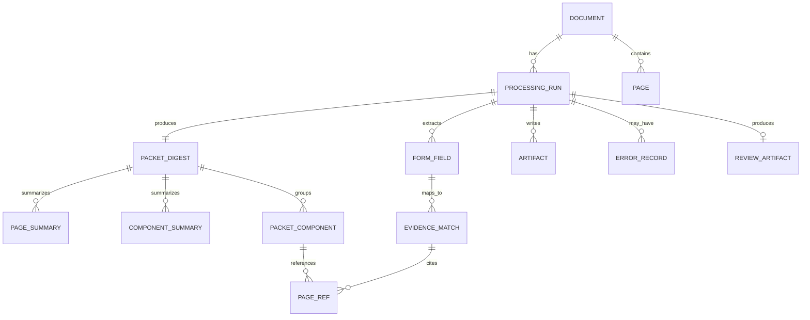
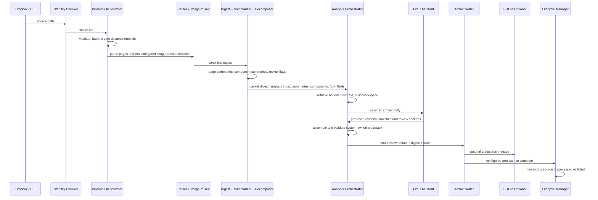
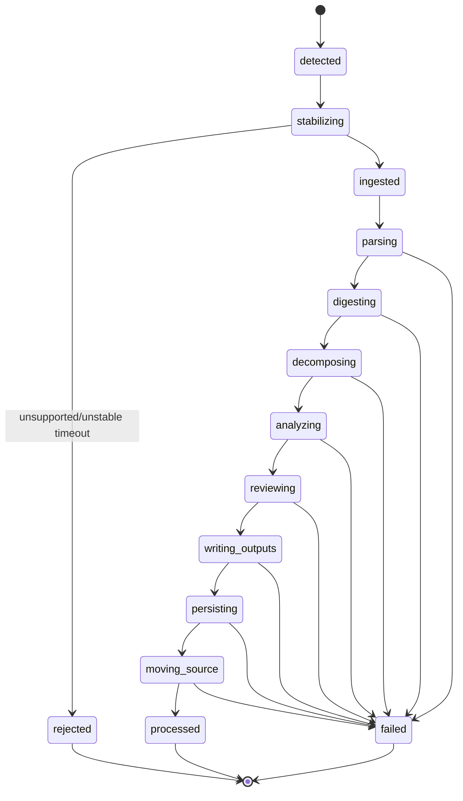

# Prior Authorization Document Intelligence Architecture

**Status:** Draft architecture authority  
**Date:** 2026-05-20  
**Product:** Prior Authorization Document Intelligence Pipeline  
**Source authority:** `docs/project/vision/pa_document_intelligence_vision.md`, `docs/project/prd/pa_document_intelligence_prd.md`, `docs/project/security-governance/governance-security-spec.md`, `docs/project/configuration/config_yaml_reference.md`, `docs/project/testing/cli-uat-harness.md`, `AGENTS.md`
**Methodology:** `docs/methodology/constitution/gendev.md`

---

## 1. Purpose and Scope

This document defines the system structure, object ownership, runtime lifecycle, persistence model,
configuration boundaries, and deferred architecture for the Prior Authorization Document
Intelligence Pipeline.

The architecture exists to prevent implementation drift while the system moves from approved PRD
to phase build plans and tactical implementation. It is authoritative for module boundaries and
object lifecycle, but not a substitute for tactical implementation plans.

### 1.1 In Scope for MVP

- Filesystem Dropbox intake.
- PDF and image parsing.
- Configurable image-to-text extraction through Tesseract baseline, optional LiteLLM vision
  extraction, hybrid fallback, and fixture compare mode.
- Page-aware canonical document representation.
- Packet digest JSON artifact as the authoritative page/component inventory.
- Compact page and component summaries inside the packet digest when native or image-derived text is
  available.
- Logical packet decomposition using original page references.
- PA form field extraction and form-to-evidence crosswalk.
- Digest-driven analysis with bounded context and reviewer-facing flags.
- Bounded LLM tool calling and selected-page vision input when supported by the selected task model
  profile.
- LiteLLM as the primary LLM routing abstraction, with task-specific model profile selection.
- JSON and Markdown/text output artifacts.
- File-only persistence mode, with optional SQLite indexing.
- CLI-first operation.

### 1.2 Out of Scope for MVP

- Approval or denial decisions.
- Manual triage workflow or operational queue.
- UI dashboard.
- Provider portal.
- EHR or PBM adjudication integration.
- Native SFTP polling/download adapter.
- Plan-specific automated policy engine.
- Template-specific PA form extraction profiles unless required by gathered fixtures.

---

## 2. Architecture Principles

1. **File artifacts are durable authority.** JSON artifacts must be sufficient to understand a run
   even when SQLite is disabled.
2. **SQLite is an optional query index.** SQLite may index run state, artifact paths, and status,
   but must not be the only storage location for nested packet digest or final review content.
3. **Original page numbers are canonical.** All downstream citations use original packet page
   numbers.
4. **The packet digest is the retrieval index.** Analysis and LLM calls must use digest-driven
   retrieval by default, not full-packet prompt assembly.
5. **Digest summaries are navigation aids.** Page and component summaries help find candidate
   evidence, but final evidence must still cite original pages and source text/image context.
6. **No fixed PA form position.** Page-count and position hints are heuristics only.
7. **The orchestrator owns limits.** The LLM may request constrained retrieval tools, but the
   orchestrator owns iteration, tool, token, retry, and wall-clock limits.
8. **Image-to-text extraction is strategy-driven.** Tesseract is the baseline, but selected pages
   may use LLM vision extraction, hybrid fallback, or compare mode when YAML and governance allow it.
9. **LLM routing is task-specific.** Image text extraction, page classification, page summaries,
   component summaries, PA form extraction, crosswalk evaluation, and final review may use different
   configured LiteLLM profiles. The default profile is only a fallback when it satisfies task
   capabilities.
10. **Reviewer flags, not manual triage.** MVP surfaces incomplete or low-confidence conditions in
   outputs. It does not route work into a manual triage queue.
11. **PHI minimization by default.** Source documents, OCR text, LLM vision text, LLM requests,
   responses, logs, and outputs are treated as PHI unless explicitly marked otherwise.
12. **CLI proves phase exits.** For this project, the CLI is the primary phase-exit UAT and systems
   integration harness. CLI commands invoke application services, write configured artifacts, and
   keep console output PHI-safe; business logic stays outside the CLI layer.

---

## 3. Terminology

| Term | Meaning |
|---|---|
| Dropbox | Configured filesystem intake directory. It may be populated by fax service, SFTP, sync job, or manual copy outside this application. |
| Source file | The original PDF or image submitted for processing. |
| Document | The application-level processing unit created from one source file. |
| Processing run | One attempt to process a document. Retries create new runs. |
| Canonical document | Page-aware normalized representation produced after native parsing and configured image-to-text extraction. |
| Page | One original source page or one standalone image treated as page 1. |
| Packet digest | System-generated JSON inventory of every page, extraction method, page type, compact summary, artifacts, components, and review flags. |
| Packet component | Logical group of original pages, such as PA form, physician notes, lab results, or fax cover sheet. |
| Page summary | Bounded summary of one page used for retrieval and component detection. It is not final evidence. |
| Component summary | Bounded summary of a packet component derived from its member pages. It is not final evidence. |
| Evidence workspace | Bounded intermediate state used by analysis to accumulate form fields, candidate evidence, citations, unresolved items, and summaries. |
| Form-to-evidence crosswalk | Mapping from extracted PA form fields/questions to supporting, missing, unclear, or contradictory evidence pages. |
| Review artifact | Final JSON assembled by the system from validated LLM sections plus system-generated digest, trace, config, and lifecycle metadata. |
| Review flag | Reviewer-facing condition such as missing required component, low extraction confidence, image-to-text disagreement, context exhaustion, or unresolved evidence. |

---

## 4. Domain Model



### 4.1 Core Objects

| Object | Owner | Required Fields |
|---|---|---|
| `Document` | Ingestion service | `document_id`, `source_path`, `source_filename`, `sha256_hash`, `detected_at`, `status` |
| `ProcessingRun` | Pipeline orchestrator | `run_id`, `document_id`, `started_at`, `status`, stage statuses, config hash |
| `CanonicalDocument` | Parser/image-to-text layer | `document_id`, `pages`, `source_hash`, extraction metadata |
| `Page` | Parser/image-to-text layer | `page_number`, `raw_text`, `normalized_text`, `extraction_method`, `image_text_strategy`, `selected_text_source`, confidence metadata, artifact paths |
| `PacketDigest` | Digest builder | `digest_version`, `page_count`, `pages`, `components`, `required_component_status`, `review_flags` |
| `PageSummary` | Digest summarizer | `page_number`, `page_summary`, `summary_method`, `summary_confidence`, max-length metadata |
| `ComponentSummary` | Digest summarizer | `component_type`, `pages`, `component_summary`, `summary_method`, max-length metadata |
| `PacketAnalysisIndex` | Digest artifact layer | derived lookup maps for pages by type, component IDs by type, candidate evidence pages, summaries by page, and text artifact paths |
| `PacketComponent` | Decomposer | `component_type`, `required`, `present`, `pages`, `confidence`, `evidence_role` |
| `FormField` | Form field extractor | `field_id`, `label`, `question`, `value`, `form_page`, required-evidence hints |
| `PaFormExtractionArtifact` | Form field extractor | artifact path, source PA form pages, extracted form components, fields/questions, values, confidence, extraction method, review flags |
| `EvidenceMatch` | Analysis/crosswalk layer | `form_field_id`, `support_status`, `supporting_pages`, `component_types`, `evidence_summary`, snippets/spans, extraction confidence, provenance, confidence |
| `AnalysisTrace` | Analysis orchestrator | analyzed/skipped/summarized/deferred pages, tool-call counts, pass counts, timeout flags |
| `ReviewArtifact` | Output assembler | final schema, embedded digest copy, analysis trace, clinical evidence, review summary |

### 4.2 Cardinality and Identity Rules

- One source file creates one `Document`.
- One `Document` may have many `ProcessingRun` records.
- A retry must create a new `ProcessingRun`; it must not overwrite prior run artifacts.
- A `Page` is identified by original `page_number` within a document.
- A `PacketComponent` is a logical page grouping and must not require physical PDF splitting.
- A `FormField` may map to zero, one, or many `EvidenceMatch` records.
- One evidence page may support, contradict, or clarify many form fields.
- A `ReviewArtifact` belongs to exactly one processing run.
- `document_id` and `run_id` must be stable across file artifacts and SQLite rows when SQLite is enabled.

---

## 5. Component Architecture

| Component | Responsibilities | Must Not Do |
|---|---|---|
| CLI | Load config, invoke commands, expose project phase-exit UAT workflows, process/status/reprocess/config validation. | Contain parsing, LLM, or lifecycle business logic. |
| Settings loader | Parse YAML, coerce paths/tuples, expose typed runtime settings. | Read secrets directly except by environment variable names. |
| Folder watcher | Detect new source files and ignore lifecycle folders. | Process files before stability checks complete. |
| Stability checker | Confirm file copy/write has settled. | Inspect clinical content. |
| Ingestion service | Validate file, compute hash, create document/run identity. | Mutate source files before successful processing. |
| Parser | Extract native PDF text, detect low-text pages, identify image inputs. | Classify PA components or call LLMs. |
| Image-to-text router | Select and execute configured Tesseract, LLM vision, hybrid, or compare strategy for low-text/image pages. | Decide clinical evidence support or silently discard alternate extraction outputs. |
| OCR service | Render/rasterize pages when needed and run Tesseract. | Decide clinical evidence support. |
| LLM vision extractor | Use LiteLLM vision-capable profiles for selected page image/crop text extraction. | Receive full packets by default or bypass LiteLLM/governance capability checks. |
| Text normalizer | Clean extraction artifacts while preserving clinically meaningful content. | Redact or alter clinical facts unless explicitly configured. |
| Page classifier | Assign likely page/component labels and confidence. | Assume PA form page position is fixed. |
| Digest builder | Produce canonical packet digest JSON and page/component inventory. | Drop unknown, blank, or low-confidence pages. |
| Digest summarizer | Produce bounded page and component summaries after native or image-derived text is available. | Treat summaries as authoritative evidence or replace source citations. |
| Packet decomposer | Group page refs into required and optional components. | Split PDFs physically in MVP. |
| Form field extractor | Extract PA fields/questions/answers/evidence requirements. | Apply payer policy or approve/deny. |
| Analysis orchestrator | Control retrieval, batching, context, retries, tool calls, and analysis limits. | Allow open-ended autonomous loops. |
| Digest retrieval tools | Provide constrained read-only access to digest/page/component text/images scoped to the active run. | Expose arbitrary filesystem, shell, network, database, secret, or config access. |
| Evidence workspace | Store intermediate evidence state and unresolved items. | Become an unbounded transcript of all page text. |
| Crosswalk generator | Assemble and validate final form-to-evidence mappings with status, provenance, snippets/spans, and page citations. | Invent citations, omit confidence, rely on summaries as final evidence, or apply payer policy. |
| Document classifier | Select document type, drug class, and prompt key. | Override required-component status. |
| Prompt manager | Load prompt YAML, schema path, prompt version, prompt map. | Hard-code clinical prompts in Python modules. |
| LLM task router | Resolve LLM task names to configured LiteLLM profiles and task prompts. | Use a single global model for every workflow task when task mappings exist. |
| LLM client | Call LiteLLM direct/proxy/local-compatible models. | Bypass LiteLLM for normal LLM paths. |
| Output validator | Validate LLM sections and final review JSON. | Accept malformed JSON as final output. |
| Artifact writer | Atomically write JSON, Markdown/text, text extracts, digest, and errors. | Write partial final files. |
| SQLite repository | Optionally index run state and artifact paths. | Become required for file-only operation. |
| File lifecycle manager | Move/copy successful and failed source files per config. | Move source to `processed` before configured persistence and outputs succeed. |

### 5.1 Current Module Mapping

| Package / Module | Architectural Role |
|---|---|
| `src/benecard_pa/cli.py` | CLI boundary |
| `src/benecard_pa/settings.py` | Settings loader and typed config model |
| `src/benecard_pa/watcher/` | Watcher/stability helpers |
| `src/benecard_pa/document/` | Parser, image-to-text router, OCR, normalizer, classifier, document models |
| `src/benecard_pa/llm/client.py` | LiteLLM client boundary |
| `src/benecard_pa/output/` | Review schema and artifact writing |
| `src/benecard_pa/db/` | Optional SQLite schema/repository |
| `src/benecard_pa/lifecycle.py` | Source file movement rules |
| `src/benecard_pa/pipeline.py` | Pipeline orchestration boundary |

---

## 6. Runtime Model



### 6.1 Runtime Rules

- CLI and watcher both enter through the same pipeline orchestration boundary.
- CLI commands are the preferred phase-exit integration surface and must remain thin adapters over
  application services.
- Native parsing and configured image-to-text extraction occur before downstream LLM review.
- Tesseract is the default baseline for low-text/image pages; LLM vision extraction is optional,
  capability-gated, and selected only by image-to-text configuration.
- Compare mode preserves both Tesseract and LLM vision outputs for evaluation and must record the
  selected text source and comparison status.
- LLM requests are assembled from selected digest-derived context by default.
- Full-packet text must not be sent by default.
- All writes of final artifacts must be atomic.
- Source movement is the last successful lifecycle stage.

---

## 7. State Lifecycle



### 7.1 Status Rules

- `processed` means all configured stages completed and source movement succeeded or was explicitly skipped by config.
- `failed` means a required stage failed and the source file was not moved to `processed`.
- `incomplete` is a reviewer-facing condition in output, not an MVP manual triage workflow.
- `needs_reviewer_attention` is a recommended next step value, not a queue state.
- Retry creates a new processing run and must preserve prior run evidence.

---

## 8. Data and Artifact Model

### 8.1 Canonical Artifact Layout

```text
output/
  doc_<document_id>/
    runs/
      run_<run_id>/
        packet_digest.json
        review.json
        summary.md
        errors.json
        pages/
          page_001.raw.txt
          page_001.normalized.txt
          page_001.png
          page_001.ocr.json
        components/
          prior_authorization_form.json
          physician_notes.json
```

The exact root paths are configurable, but the run-specific artifact boundary is required so retry
artifacts do not overwrite earlier processing evidence.

### 8.2 File-Only Persistence

File-only mode is valid for MVP. In file-only mode:

- `packet_digest.json` is the authoritative digest record.
- Page and component summaries in `packet_digest.json` are retrieval aids and must remain bounded
  by configuration.
- `review.json` is the authoritative final review artifact.
- `summary.md` is the reviewer-facing summary.
- `errors.json` captures machine-readable failure details when available.
- Source path, processed path, run ID, config hash, prompt version, and model metadata must appear
  in artifacts where relevant.

### 8.3 Optional SQLite Persistence

When enabled, SQLite indexes:

- document identity and source hash;
- processing run status;
- packet digest artifact path and high-level status;
- component page refs and confidence;
- analysis trace metadata;
- LLM review metadata and structured output reference;
- artifact paths;
- error records.

SQLite must not become the only location for nested digest or final review content.

---

## 9. Interfaces and Integration Points

| Interface | Direction | Contract |
|---|---|---|
| Dropbox directory | Inbound | Filesystem path containing supported source files. Lifecycle subfolders ignored. |
| Config YAML | Inbound | Runtime paths, parser/image-to-text behavior, digest behavior, analysis limits, LiteLLM profiles, prompts, lifecycle, security. |
| Prompt YAML | Inbound | Prompt templates, classifier keywords, required evidence hints, prompt version. |
| Review schema JSON | Inbound | Structured output validation contract. |
| Tesseract binary | Outbound local | OCR subprocess/library integration through `pytesseract`. |
| LiteLLM | Outbound network/local | Model routing for remote providers, proxy, or local OpenAI-compatible endpoints. |
| Output folder | Outbound | Atomic file artifacts. |
| SQLite | Optional local persistence | Queryable run/status/artifact index. |
| CLI | Operator interface | Config validation, init DB, process once, status/reprocess commands as implemented. |

---

## 10. Configuration Model

Configuration is loaded from YAML and environment variables.

| Section | Architectural Ownership |
|---|---|
| `paths` | Filesystem boundaries and artifact roots. |
| `watcher` | Intake behavior and lifecycle-folder ignores. |
| `database` | Optional SQLite enablement and path. |
| `parsing` | Text-density thresholds, render DPI, baseline OCR engine/language, text artifact retention. |
| `image_text_extraction` | Tesseract, LLM vision, hybrid, and compare-mode strategy controls. |
| `packet_decomposition` | Required/optional components and form-to-evidence crosswalk requirement. |
| `packet_digest` | Digest artifact behavior, page/component summaries, review-flag threshold, artifact layout. |
| `analysis` | Mode, context limits, loop limits, retrieval restrictions, tool calling, reviewer flags. |
| `llm` | LiteLLM model profiles, default profile, task profile map, and model capability flags. |
| `prompts` | Prompt/schema paths, document-type prompt map, and task prompt map. |
| `file_lifecycle` | Successful/failed movement, naming, hash verification, collision handling. |
| `security` | Logging, raw response/request storage, output encryption flags. |

Rules:

- Secrets must be referenced by environment variable name; never hard-code secret values in YAML.
- Prompts and schema paths are configuration, not Python constants.
- Context, tool-call, and timeout limits must be configurable.
- Model switching must not require code changes.
- LLM task profile mappings must be configurable for image text extraction, page classification,
  page summaries, component summaries, PA form extraction, crosswalk evaluation, and final review.
- Configuration validation must reject unsupported image-to-text strategies, unknown image-to-text
  LLM task mappings, nonpositive parser text thresholds, unsafe source-filename artifact layouts,
  unapproved public task-profile routing, unapproved raw LLM response storage, and vision
  strategies without vision-capable profiles.
- Tool calling, vision input, and structured output support must be declared on the selected
  task-specific LLM profile and enforced by the analysis orchestrator before each call.

### 10.1 LLM Task Routing Rules

- The workflow resolves a model profile by LLM task name, not only by global default.
- Supported task names include `image_text_extraction`, `page_classification`, `page_summary`,
  `component_summary`, `pa_form_extraction`, `crosswalk_evaluation`, and `final_review`.
- The first implemented task-routing slice may be limited to `page_classification`, `page_summary`,
  and `component_summary` so Phase 3 can classify pages and create digest summaries through
  LiteLLM without introducing tool calling, crosswalk evaluation, or final review generation.
- If `llm.task_profiles` does not define a task, the system may use `llm.default_profile` only if
  the default profile satisfies that task's capability requirements.
- The task router must reject or flag a task when the selected profile lacks required capabilities
  such as structured output, tool calling, vision support, or image capacity.
- Prompt selection may also be task-scoped through `prompts.task_prompt_map`; document-type prompts
  remain available for final review and domain-specific behavior.

---

## 11. Error and Failure Behavior

| Failure | Required Behavior |
|---|---|
| Unsupported file | Reject or quarantine per config, with PHI-safe error. |
| Unstable file | Do not process until stability checks pass or timeout fails safely. |
| Duplicate hash | Avoid duplicate processing unless explicit reprocess is requested. |
| Parser/image-to-text failure | Preserve source and any allowed intermediate artifacts; write error artifact. |
| Missing required component | Mark incomplete and emit review flag; do not invent crosswalk evidence. |
| Low-confidence or missing summary | Preserve the page/component inventory and emit review flags when useful; do not fail the run solely because a summary is unavailable. |
| Context/tool limit reached | Stop bounded analysis and emit review flag. |
| LLM failure | Retry within configured limits; fail run if retries exhausted. |
| Schema validation failure | Do not save malformed LLM output as final review. |
| Output write failure | Do not move source to `processed`. |
| SQLite failure when enabled | Treat configured persistence as failed; do not move source to `processed`. |
| Source move failure | Record lifecycle failure; do not mark run processed. |

Errors must not include raw patient text or full prompts by default. Parser errors that originate
from third-party PDF or image libraries must be normalized into PHI-safe messages before reaching
CLI output, artifacts, or logs.

### 11.1 Crosswalk Construction Rules

- The crosswalk generator is system-owned. LLM calls may propose matches, but the final artifact is
  assembled and schema-validated by the system.
- Every extracted PA form field/question that is not excluded by configured
  administrative/contact/routing field pruning must have a crosswalk item, including `missing` or
  `unclear` outcomes. Excluded administrative fields remain available in form extraction artifacts,
  but are removed from evaluated evidence crosswalk artifacts to reduce reviewer noise.
- `support_status` must be one of `supported`, `contradicted`, `missing`, or `unclear`.
- Supported and contradicted items must cite original packet pages and component types.
- Source snippets or span references should be included when available from native, OCR, or LLM
  vision text.
- Evidence confidence should account for extraction confidence, page/component classification confidence,
  retrieval confidence, and evidence-match confidence when available.
- Page/component summaries may retrieve candidates, but must not be the only basis for final
  evidence support.
- Crosswalk output demonstrates document support only. It must not apply payer policy or recommend
  approval/denial.

### 11.2 LLM Tool Calling and Vision Boundary

The MVP may use tool-assisted, digest-driven document analysis. Tool use is not an open-ended agent
loop. For Phase 6, tools are orchestrator-owned active-run operations used to assemble bounded
context before LLM calls; provider-native model tool-call loops remain deferred. The analysis
orchestrator owns tool execution, iteration limits, context limits, retry behavior, and stop
conditions.

Allowed tools are limited to configured document-analysis operations, such as reading the packet
digest, listing component pages, retrieving selected page text, retrieving selected page images when
vision is enabled, searching packet text, retrieving component text, and recording evaluated
evidence observations into Phase 6 evaluation artifacts and trace metadata.

The LLM must not receive arbitrary filesystem, shell, database, network, secret, or configuration
access. Tool calls must operate only on the current document/run scope and must use original packet
page numbers as canonical references.

Vision-capable models may receive selected page images or rendered page crops only when enabled by
YAML configuration and supported by the selected task-specific LiteLLM model profile. Full packet
image/PDF submission is disabled by default.

When LLM vision is used for image-to-text extraction, it is a bounded extraction task, not a
general document-review shortcut. The selected page image/crop, task prompt, task profile, output
artifact path, confidence metadata, and selected/alternate text source must be auditable.

LLM-generated summaries, evidence observations, and evidence matches are advisory intermediate
outputs. The system owns final crosswalk assembly, schema validation, provenance enforcement,
review flags, and artifact writing.

---

## 12. Security and Governance Boundaries

### 12.1 PHI Boundary

The following are PHI-bearing unless explicitly proven otherwise:

- source files;
- rendered page images;
- OCR text;
- LLM vision extracted text;
- normalized text;
- packet digest page signals;
- packet digest page and component summaries;
- LLM request context;
- LLM response content;
- review JSON and Markdown summaries;

Files under `docs/project/reference/clinical-samples/` are the current approved non-PHI clinical
reference corpus. They are valid inputs for unit tests, integration tests, and user acceptance
testing. New files added to that folder require non-PHI confirmation before commit.
- SQLite rows containing identifiers or excerpts;
- logs with paths or document metadata.

### 12.2 Required Controls

- Logs must avoid raw document text and full prompts by default.
- API keys must come from environment variables or a secret store.
- The LLM client must log metadata only unless PHI logging is explicitly enabled and approved.
- Output folders, temp folders, and SQLite paths must be access-controlled by deployment.
- Review artifacts are decision support only and must not present an approval/denial.
- The LLM must not receive arbitrary filesystem access.
- Digest retrieval tools must be constrained to the active document/run.
- Tool-call execution must be denied when the selected task model profile or analysis configuration
  does not support the requested capability.
- Task-specific LLM calls must record task name, selected profile, model name, prompt key/version,
  and capability flags in audit metadata.

### 12.3 Canonical Governance and Security Spec

Detailed governance and security requirements are canonical in
`docs/project/security-governance/governance-security-spec.md`. Architecture changes that affect PHI
handling, filesystem access, LLM routing, tool calling, model/provider approval, audit records,
retention, encryption, secrets, or policy separation must be checked against that specification
before implementation.

---

## 13. Observability and Audit Model

Each processing run should record:

- document ID and run ID;
- source filename, source path, and hash;
- detected/started/completed timestamps;
- stage statuses and durations;
- config hash;
- LLM task name, prompt key, and prompt version;
- model provider/profile/model name;
- parser/image-to-text methods, selected text sources, fallback counts, and compare disagreements;
- digest version and artifact path;
- analyzed/skipped/summarized/deferred pages;
- tool-call and analysis pass counts;
- context exhaustion and timeout flags;
- review flags;
- final source lifecycle path;
- error records when applicable.

Structured logs should capture stage transitions and timings without raw PHI.

---

## 14. Extension Points

| Extension Point | MVP Boundary | Later-Phase Use |
|---|---|---|
| Intake adapters | Filesystem Dropbox only. | Native SFTP polling/download, API intake. |
| Image-to-text engines | Tesseract baseline with configurable LiteLLM vision, hybrid, and compare strategies. | OCRmyPDF preprocessing, commercial OCR, handwriting OCR, task-tuned vision models. |
| Page classifiers | Configurable rules and model-assisted labels. | Template-specific classifiers. |
| Digest summaries | Bounded page/component summaries after native or image-derived text extraction. | Provider-specific summarizers or learned retrieval indexes. |
| PA form extraction | Generic/configurable extraction. | Form-template profiles. |
| Analysis modes | `single_pass`, `staged`, `tool_assisted` with bounded limits. | Advanced retrieval/evaluation loops. |
| LLM routing | LiteLLM direct/proxy/local profiles with task-specific profile maps. | Provider-specific optimization and task-level model tuning. |
| Persistence | File artifacts with optional SQLite. | Queue/database backend for multi-worker scale. |
| Review experience | JSON/Markdown/CLI status. | Dashboard, manual triage queue, reviewer workflow. |
| Policy application | Evidence summary only. | Plan-specific rules engine. |

---

## 15. Deferred Architecture

The following are explicitly not authorized for MVP implementation unless the PRD and phase plan
are updated:

- manual triage workflow or operational queue;
- UI dashboard;
- native SFTP adapter;
- automated policy approval/denial;
- PBM adjudication system integration;
- EHR integration;
- CMS prior authorization API integration;
- multi-tenant access control;
- fine-tuned OCR or LLM models;
- specialized handwriting recognition guarantees;
- provider-facing portal;
- advanced analytics and feedback loop.

---

## 16. Acceptance Criteria Seeds

Architecture-derived checks for phase planning:

- A parser test proves every original PDF page appears exactly once in the canonical document.
- An image-to-text strategy test proves Tesseract baseline, LLM vision, hybrid fallback, and
  compare mode select and record page text sources according to configuration.
- A digest test proves unknown pages are retained rather than dropped.
- A digest artifact test proves `packet_digest.json` is sufficient without SQLite.
- A digest summary test proves page/component summaries are bounded, configurable, and do not
  replace original page citations.
- A config test proves SQLite can be disabled while file artifacts remain enabled.
- A lifecycle test proves source files are not moved to `processed` before output and configured
  persistence complete.
- A retrieval test proves LLM context is selected from digest/page/component refs, not full packet
  text by default.
- A review schema test proves final JSON contains system-generated digest and analysis trace.
- A review flag test proves missing required components create reviewer-facing flags, not manual
  triage routing.
- A crosswalk completeness test proves every extracted PA form field/question receives a crosswalk
  item.
- A crosswalk provenance test proves supported and contradicted items include original page
  citations, component types, confidence, and source snippets or span references when available.
- A contradiction test proves contradicted evidence is represented as a first-class crosswalk
  outcome.
- A policy separation test proves crosswalk output does not approve or deny a request.
- A PHI logging test proves raw page text and full prompts are not logged by default.
- A LiteLLM boundary test proves model calls flow through the LiteLLM client abstraction.
- A Phase 3 LLM task routing test proves page classification and digest summarization resolve
  configured profiles and reject unsupported capabilities.
- A later LLM task routing test proves crosswalk evaluation and final review can resolve different
  configured profiles and reject unsupported capabilities.

---

## 17. Open Architecture Decisions

| Decision | Status |
|---|---|
| Exact production retention period for source files, page artifacts, outputs, logs, and SQLite records. | Open compliance/operations decision tracked by the governance/security spec. |
| Whether public LLM APIs are allowed in any client environment. | Open deployment decision tracked by the governance/security spec; architecture supports both public and private/local profiles. |
| Required PA form templates. | Unknown; MVP uses generic/configurable extraction. |
| Additional drug classes beyond GLP-1. | Unknown; MVP supports fallback generic prior authorization handling. |
| Final fixture corpus size and golden expected outputs. | Approved non-PHI clinical reference samples exist under `docs/project/reference/clinical-samples/`; final golden expected outputs and additional edge-case fixtures remain open until evaluation design completes. |
| Encryption-at-rest requirement. | Open compliance/operations decision tracked by the governance/security spec. |

---

## 18. Accuracy Pass

- **Undefined terms:** Core terms are defined in Section 3.
- **Ownership boundaries:** Component ownership and "must not do" rules are defined in Section 5.
- **Lifecycle gaps:** Source movement is last; retry creates a new processing run.
- **Persistence ambiguity:** File artifacts are authoritative; SQLite is optional.
- **Security boundaries:** PHI-bearing artifacts and LLM/tool boundaries are identified.
- **Deferred features:** Deferred architecture is listed explicitly and must not enter MVP by drift.
- **Tactical details left out:** Implementation sequencing remains for phase build and tactical plans.
